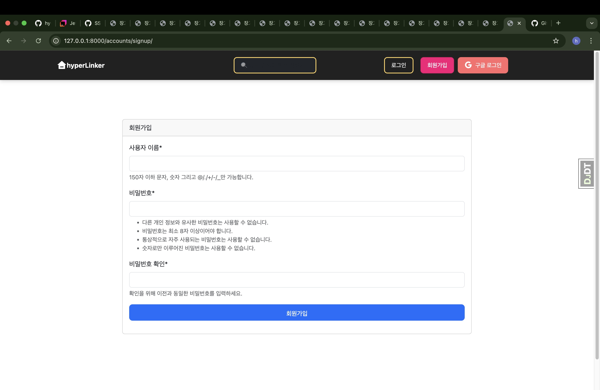

# hyperlinker-hyunzy

## 🔐 로그인 후 기능 사용 (보안)

### 🔑 로그인 / 회원가입 - JWT 인증 방식
일반 로그인 / 회원가입을 제공합니다.




### 🌐 로그인 / 회원가입 - 구글 간편 로그인
구글 계정을 활용한 간편 로그인을 지원합니다.


---

## 🔗 웹 링크 관리

### 📌 웹 링크 등록, 수정, 삭제
사용자는 자신만의 웹 링크를 추가하고 수정하거나 삭제할 수 있습니다.


### ✅ 공유 기능 사용법
1. 공유할 링크의 **🔗 공유 버튼**을 클릭합니다.
2. 공유할 대상 유저를 선택하고 **✅ 확인 버튼**을 누릅니다.
3. 마이페이지에서 공유된 링크를 확인할 수 있습니다.

### ✅ 권한 관리
- 공유한 링크는 마이페이지의 **📤 내가 공유한 링크**에서 관리할 수 있습니다.
- 다른 사용자에게 부여한 쓰기 권한(✍️)을 설정하거나 해제할 수 있습니다.
- **공유받은 링크**는 **📥 내가 공유받은 링크**에서 확인 가능합니다.

### ✅ 확인
- `hyunzy engel` 계정에서 `hyunzy` 계정으로 공유한 후, `hyunzy`로 로그인하면 공유받은 링크를 확인할 수 있습니다.


## 📤 공유 및 권한 관리

### 🗂 마이페이지 - 내가 공유한 링크 / 공유 받은 링크 확인
공유한 링크와 공유받은 링크를 한눈에 확인할 수 있습니다.


---

## 🔍 검색 및 필터

### 🔎 검색 및 카테고리별 링크 정리
필요한 링크를 검색하고, 카테고리별로 정리할 수 있습니다.


---

## 📌 프로젝트 정보

- **기술 스택**: React, Django, PostgreSQL, JWT 인증
- **주요 기능**: 링크 관리, 검색, 공유 및 권한 관리, JWT 및 구글 로그인
- **개발 목표**: 보안이 강화된 웹 링크 저장 및 공유 플랫폼 제공

## 📌 설치 및 실행 방법

```bash
# 파일 설치 및 실행
pip install -r requirements.txt
python manage.py runserver
```
---

## 🔍 트러블슈팅 경험 및 느낀 점

개발 과정에서 Django를 활용하며 다음과 같은 주요 문제를 해결하는 경험을 하였습니다.

### 1️⃣ Django에서 커스텀 User 모델을 적용할 때 ORM 충돌 발생
- `AUTH_USER_MODEL` 변경 시 기존 `auth.User` 모델을 참조하여 오류 발생
- `get_user_model()`을 사용하여 유연성을 확보하는 것이 중요
- 마이그레이션과 데이터베이스 변경 시 충돌을 방지하기 위한 사전 점검 필요

### 2️⃣ Django JWT 인증 적용 후 자동 로그아웃 문제 발생
- `refresh_token`을 활용하지 않으면 일정 시간 후 인증이 만료됨
- `httponly` 쿠키를 사용하면 보안성이 높아지지만, 클라이언트에서 접근이 불가능하므로 `fetch()`를 통한 토큰 갱신이 필수
- 프론트엔드와 백엔드의 인증 흐름을 정확히 이해하고, 자동 로그인 유지 로직을 구현해야 함

### 🔹 느낀 점
이 과정에서 Django의 ORM과 인증 시스템을 보다 깊이 이해하게 되었으며,
백엔드와 프론트엔드 간의 인증 흐름을 설계하는 데 중요한 개념들을 익혔습니다.
또한, 실무에서 **보안성과 유지보수성을 고려한 인증 로직 설계**가 필수적임을 다시 한번 깨달았습니다.

---